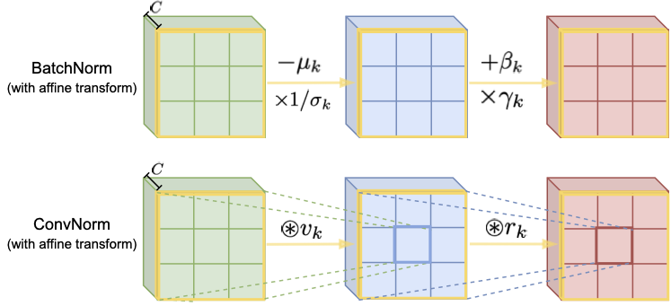

# ConvNorm
This repository is the official implementation of Convolutional Normalization: Improving Robustness and Training for Deep Neural Networks

We introduce a simple and effi-cient “convolutional normalization” method thatcan fully exploit the convolutional structure in theFourier domain and serve as a simple plug-and-play module to be conveniently incorporated intoany ConvNets. We show that convolutional normalization can reduce the layerwise spectral norm of the weight matrices and hence improve the Lipschitzness of the network, leading to easier training and improved robustness for deep ConvNets. Applied to classification under noise corruptions and generative adversarial network (GAN), we show that convolutional normalization improves the robustness of common ConvNets such as ResNet and the performance of GAN.

 
<figcaption align="center">
These graphs show the comparison between BatchNorm and ConvNorm on activations of $k=1,\dots,C$ channels. BatchNorm subtracts and multiplies the activations of each channel by computed scalars: mean $\mu$ and variance $\sigma^2$, before a per-channel affine transform parameterized by learned parameters $\beta$ and $\gamma$; ConvNorm performs per-channel convolution with precomputed kernel $v$ to normalize the spectrum of the weight matrix for the convolution layer, following with a channel-wise convolution with learned kernel $r$ as the affine transform..
</figcaption>

